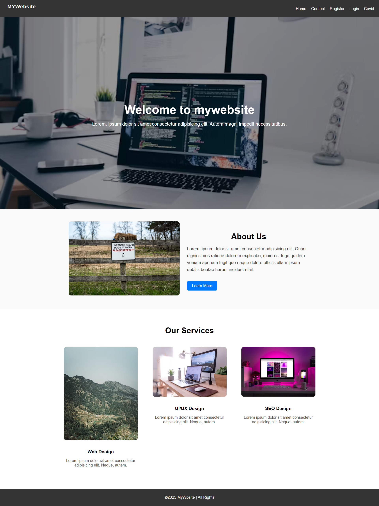
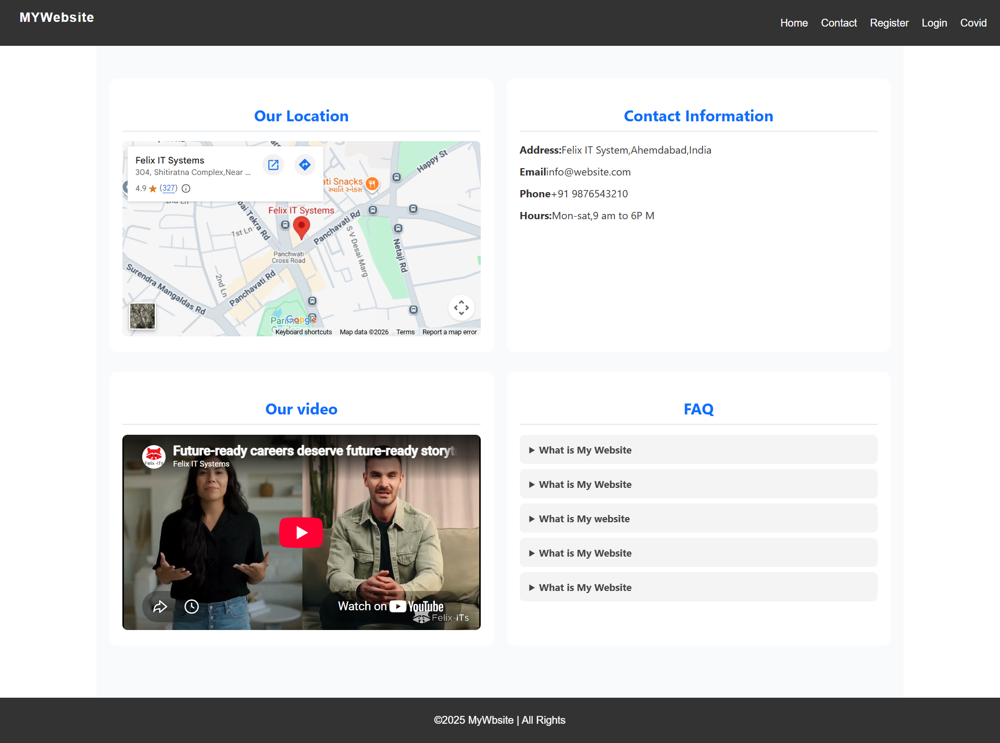
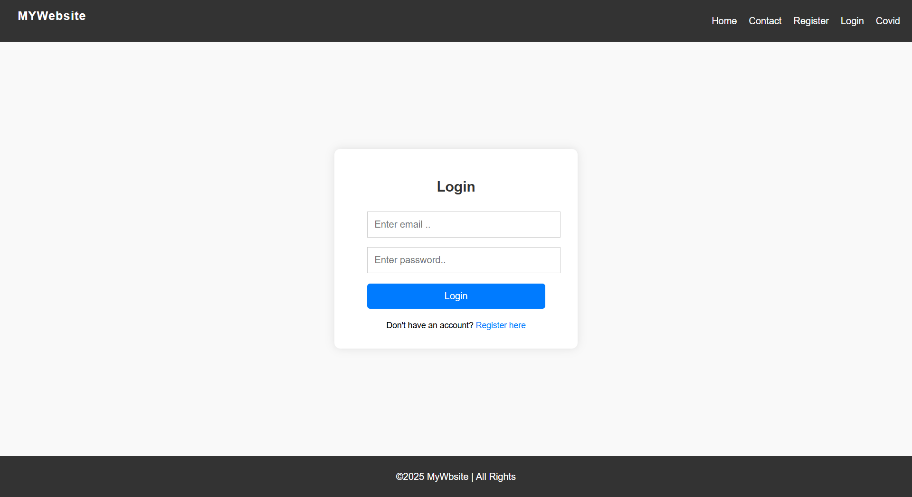
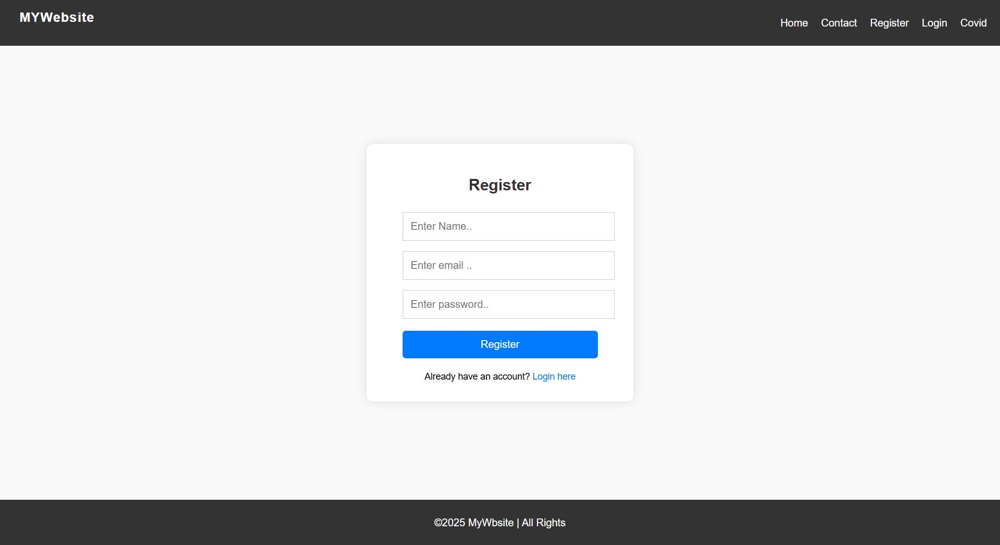

# 🌐 MyWebsite — Multi-Page HTML & CSS Website

A clean, responsive, and beginner-friendly multi-page website built using **HTML5 and CSS3**. This project demonstrates essential frontend development concepts including navigation, responsive layouts, forms, service cards, tables, embedded content, and FAQ sections.

## 🚀 Live Demo

🔗 **Live Website:**


---

## 📌 About The Project

**MyWebsite** is a multi-page frontend website created to practice and demonstrate core HTML and CSS concepts.

The website contains multiple interconnected pages with a consistent navigation bar and footer. It also includes external integrations such as Google Maps and a YouTube video.

### 📄 Available Pages

* 🏠 Home
* 📞 Contact
* 📝 Register
* 🔐 Login
* 🦠 COVID Data

---

## ✨ Features

* ✅ Responsive navigation bar
* ✅ Multi-page website structure
* ✅ Hero/banner section
* ✅ About Us section
* ✅ Services section with cards
* ✅ Contact information
* ✅ Google Maps integration
* ✅ YouTube video integration
* ✅ FAQ section
* ✅ Login form
* ✅ Registration form
* ✅ COVID-19 data table
* ✅ Responsive layout
* ✅ Reusable footer
* ✅ Clean and simple UI

---

## 🛠️ Technologies Used

| Technology  | Usage                         |
| ----------- | ----------------------------- |
| HTML5       | Website structure             |
| CSS3        | Styling and responsive design |
| Google Maps | Location integration          |
| YouTube     | Video integration             |

---

## 📂 Project Structure

```text
mywebsite-html-css/
│
├── index.html
├── contact.html
├── login.html
├── register.html
├── covid.html
│
├── css/
│   └── style.css
│
├── img/
│   ├── about.jpeg
│   ├── 1.jpg
│   ├── 2.avif
│   └── 3.jpg
│
├── screenshots/
│   ├── home.png
│   ├── contact.png
│   ├── login.png
│   └── register.png
│
└── README.md
```

---

## 📸 Project Screenshots

<div align="center">

<table>
  <tr>
    <td align="center">
      
      <br/>
      <b>Home Page</b>
    </td>

```
<td align="center">
  
  <br/>
  <b>Contact Page</b>
</td>

<td align="center">
  
  <br/>
  <b>Login Page</b>
</td>

<td align="center">
  
  <br/>
  <b>Register Page</b>
</td>
```

  </tr>
</table>

</div>

---

## 🏠 Home Page

The Home page includes:

* Navigation bar
* Hero banner
* Welcome section
* About Us section
* Services section
* Service cards
* Footer

---

## 📞 Contact Page

The Contact page provides:

* 📍 Google Maps location
* 📧 Email information
* 📱 Phone number
* 🕐 Working hours
* 🎥 Embedded YouTube video
* ❓ Frequently Asked Questions

---

## 🔐 Login Page

The Login page contains a simple authentication UI with:

* Email input
* Password input
* Login button
* Registration link

> Note: This is currently a frontend-only form and does not perform actual authentication.

---

## 📝 Registration Page

The Registration page includes:

* Name field
* Email field
* Password field
* Register button
* Login link

> Note: Registration functionality is currently frontend-only.

---

## 🦠 COVID Data Page

The COVID page displays data in a structured table containing:

| Country | Cases     | Deaths   | Recovered |
| ------- | --------- | -------- | --------- |
| India   | 44,00,000 | 5,30,000 | 43,00,000 |
| USA     | 50,00,000 | 5,30,000 | 47,00,000 |
| Russia  | 60,00,000 | 5,30,000 | 43,00,000 |

---

## 📱 Responsive Design

The website follows responsive design principles and is designed to work across:

* 💻 Desktop
* 💻 Laptop
* 📱 Mobile
* 📲 Tablet

---
